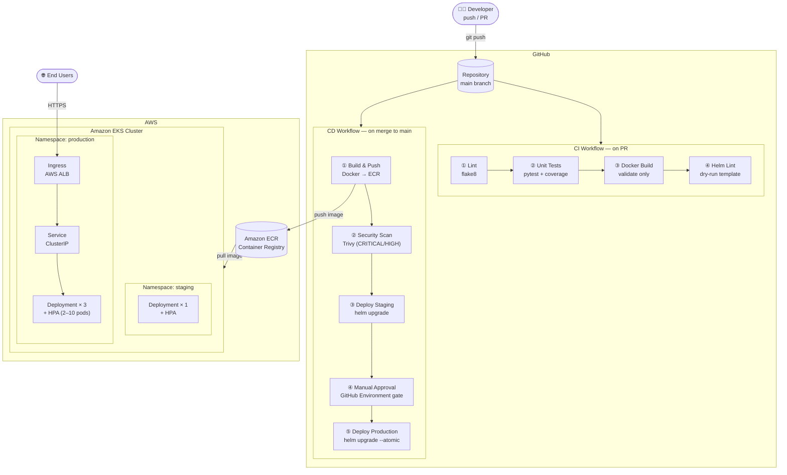

# CI/CD Pipeline — GitHub Actions + Docker + Amazon EKS + Helm

> Production-grade CI/CD pipeline: automated testing, Docker builds, ECR registry, and zero-downtime Kubernetes deployments via Helm on Amazon EKS.


---

## Architecture



---

## Tech Stack

| Layer | Tool |
|---|---|
| App | Python 3.12 / Flask |
| Containerisation | Docker (multi-stage build) |
| Container Registry | Amazon ECR |
| CI/CD | GitHub Actions |
| Security Scanning | Trivy (Aqua Security) |
| Orchestration | Amazon EKS (Kubernetes) |
| Package Manager | Helm 3 |
| Auto-scaling | HPA (CPU + Memory) |
| Ingress | AWS ALB Ingress Controller |

---

## Repository Structure

```
cicd-eks-demo/
├── .github/
│   └── workflows/
│       ├── ci.yml          # Lint → Test → Docker build check → Helm lint
│       └── cd.yml          # Build → ECR push → Security scan → EKS deploy
├── app/
│   ├── main.py             # Flask application
│   ├── requirements.txt    # Production dependencies
│   ├── requirements-dev.txt
│   └── tests/
│       └── test_app.py     # pytest unit tests
├── helm/
│   └── app/
│       ├── Chart.yaml
│       ├── values.yaml     # Default values (override per env)
│       └── templates/
│           ├── _helpers.tpl
│           ├── deployment.yaml
│           ├── service.yaml
│           ├── ingress.yaml
│           ├── hpa.yaml
│           └── serviceaccount.yaml
├── Dockerfile              # Multi-stage, non-root user
├── .dockerignore
└── README.md
```

---

## CI/CD Pipeline — Step by Step

### CI (on every PR → main)

```
PR opened
   │
   ├─① flake8 lint ──────────────────────────────── fail fast
   │
   ├─② pytest (coverage report uploaded as artifact)
   │
   ├─③ docker build (validates Dockerfile, no push)
   │
   └─④ helm lint + helm template --dry-run
```

### CD (on merge to main)

```
Merge to main
   │
   ├─① docker build + push → ECR (tagged :sha + :latest)
   │
   ├─② Trivy scan — block on CRITICAL/HIGH CVEs
   │
   ├─③ helm upgrade → staging namespace (auto)
   │
   ├─④ GitHub Environment gate — manual approval required
   │
   └─⑤ helm upgrade --atomic → production namespace
             └── auto rollback if rollout fails
```

---

## Prerequisites

| Requirement | Version |
|---|---|
| AWS Account | — |
| Amazon EKS Cluster | ≥ 1.28 |
| AWS ALB Ingress Controller | installed on cluster |
| Amazon ECR repository | created |
| GitHub repository | with Actions enabled |

---

## Setup Guide

### 1. Clone the Repository

```bash
git clone https://github.com/aarifkhan08/ci-cd-project.git
cd ci-cd-project
```

### 2. Create Amazon ECR Repository

```bash
aws ecr create-repository \
  --repository-name cicd-eks-demo \
  --region us-east-1
```

### 3. Configure GitHub Secrets & Variables

In your GitHub repository go to **Settings → Secrets and variables → Actions**.

**Repository Secrets** (`Settings → Secrets`):

| Secret | Description |
|---|---|
| `AWS_ACCESS_KEY_ID` | IAM user access key |
| `AWS_SECRET_ACCESS_KEY` | IAM user secret key |

**Repository Variables** (`Settings → Variables`):

| Variable | Example |
|---|---|
| `AWS_REGION` | `us-east-1` |
| `EKS_CLUSTER_NAME` | `my-eks-cluster` |

**GitHub Environments** (for production gate):

1. Go to **Settings → Environments → New environment**
2. Create `staging` and `production`
3. For `production`, add **Required reviewers** to enforce manual approval

### 4. IAM Permissions

The IAM user needs these policies:

```json
{
  "Version": "2012-10-17",
  "Statement": [
    {
      "Effect": "Allow",
      "Action": [
        "ecr:GetAuthorizationToken",
        "ecr:BatchCheckLayerAvailability",
        "ecr:InitiateLayerUpload",
        "ecr:UploadLayerPart",
        "ecr:CompleteLayerUpload",
        "ecr:PutImage",
        "ecr:BatchGetImage"
      ],
      "Resource": "*"
    },
    {
      "Effect": "Allow",
      "Action": [
        "eks:DescribeCluster"
      ],
      "Resource": "arn:aws:eks:REGION:ACCOUNT_ID:cluster/CLUSTER_NAME"
    }
  ]
}
```

### 5. Run Locally

**Without Docker:**
```bash
pip install -r app/requirements-dev.txt
python app/main.py
# → http://localhost:8080
```

**With Docker:**
```bash
docker build -t cicd-demo:local .
docker run -p 8080:8080 cicd-demo:local
# → http://localhost:8080
```

**Run tests:**
```bash
pip install -r app/requirements-dev.txt
pytest app/tests/ -v --cov=app
```

**Helm dry-run:**
```bash
helm template cicd-demo helm/app/ \
  --set image.repository=123456789.dkr.ecr.us-east-1.amazonaws.com/cicd-eks-demo \
  --set image.tag=abc1234 \
  --set ingress.host=demo.example.com
```

### 6. Deploy Manually to EKS

```bash
# Configure kubectl
aws eks update-kubeconfig --name YOUR_CLUSTER --region us-east-1

# Deploy
helm upgrade --install cicd-demo helm/app/ \
  --namespace production \
  --create-namespace \
  --set image.repository=YOUR_ECR_URI/cicd-eks-demo \
  --set image.tag=latest \
  --set ingress.host=demo.example.com \
  --wait

# Verify
kubectl get pods -n production
kubectl get ingress -n production
```

---

## Application Endpoints

| Endpoint | Description |
|---|---|
| `GET /` | App info (version, environment) |
| `GET /health` | Liveness probe — returns `{"status":"healthy"}` |
| `GET /ready` | Readiness probe — returns `{"status":"ready"}` |

---

## Kubernetes Features

| Feature | Config |
|---|---|
| Rolling update (zero-downtime) | `maxSurge: 1`, `maxUnavailable: 0` |
| Liveness / Readiness probes | `/health` and `/ready` |
| Horizontal Pod Autoscaler | 2–10 replicas, CPU 70% / Mem 80% |
| Pod anti-affinity | Spread pods across nodes |
| Non-root container | `runAsUser: 1000` |
| Read-only root filesystem | `readOnlyRootFilesystem: true` |
| Dropped Linux capabilities | `drop: [ALL]` |

---

## Screenshots

> Add screenshots after your first deployment.

| What | Screenshot |
|---|---|
| GitHub Actions — CI run passing | `docs/screenshots/ci-pass.png` |
| GitHub Actions — CD run with approval gate | `docs/screenshots/cd-approval.png` |
| Kubernetes pods running in EKS | `docs/screenshots/eks-pods.png` |
| App running — `/` endpoint | `docs/screenshots/app-response.png` |

---

## License

MIT — see [LICENSE](LICENSE).
